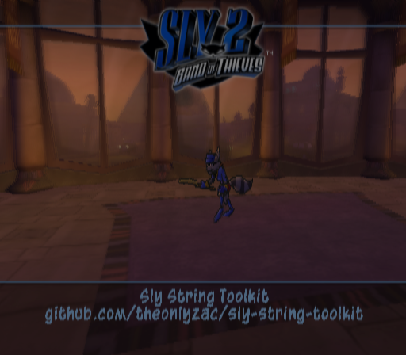

# Sly String Toolkit

This is a toolkit for making string replacement mods for *Sly 2: Band of Thieves* on the PS2. For a complete tutorial, see [this guide](https://slymods.info/wiki/Guide:Replacing_strings).

# Usage

`python main.py <input_csv> <options>`

The script supports the following optional arguments:

* `-o <output_dir>` - The output directory for the pnach file (default is `./out/`)
* `-n <mod_name>` - The name of the mod. The output file will be `<crc>.<mod name>.pnach` (default is the same as the input file)
* `-r <region>` - The region of the game. Can be `ntsc` or `pal` (default is `ntsc`)
* `-d <dialect>` - The language the pnach should work for (PAL only). If not set, it will affect all languages.
  * Can be `en`, `fr`, `it`, `de`, `es`, `nd`, `pt`, `da`, `fi`, `no`, or `sv`.
  * Pnach files for multiple languages are not compatible with one another.
* `-l` - Enable live edit mode. This will allow you to edit the strings in the csv and the pnach will automatically update.
* `-v` - Enable verbose output
* `-h` - Show help

# Setup

1. Install Python 3.8 or higher.

2. Clone the repository with `git clone https://github.com/theonlyzac/sly-string-toolkit.git`

3. Install the dependencies with `pip install -r requirements.txt`

4. Run `python main.py <input_file>` to generate the `.pnach` file.
   * Use the `-o` argument to specify the output directory if desired.

6. Put the `.pnach` file in your `pcsx2/cheats` folder, enable cheats, and start the game.

# Output 

The script will output one pnach file. It contains the assembly code to load the custom strings as well as the strings themselves.

You should put this file in your `pcsx2/cheats` folder. You can rename file if you want, but it must start with `07652DD9.` (including the dot) and end with `.pnach`.

# Strings CSV Format

The input file should be a CSV where each row has the following format:

`<string id>,<string>,<optional target address>`

* `<string id>` is the ID of the string you want to replace
* `<string>` is the string to replace it with
* `<optional target address>` is the address to write the string to. If not specified, it will be written with the rest of the strings in a block at the address specified by the `-a` option.

Everything after the third column is ignored by the script, so you can use them for notes if you want. You can make the file in Excel or Google Sheets and then export it as a CSV.

# Live Edit

The `-l` option enables live edit mode. When enabled, the script will watch the input file for changes and update the pnach file automatically. This allows you to edit the strings in the CSV file while the game is running. Press `ctrl+c` to stop the script.

PCSX2 will not automatically reload the pnach file when it changes, so you will not see your changes immediately. However, it does automatically reload cheats each time you save or load a save state, so you can press `F1` to create a save state which will quickly reload the pnach. Note that this will overrite whatever save state you have selected.

# How it works

This script hooks the string load function with custom code that instead loads the strings you specify in the CSV file. It does this by writing the strings to a block of memory and loads the strings from that block of memory instead of the original string table.

The way the game normally loads any string is by iterating over a table that contains the IDs for all the strings in the game. If it finds a match, it loads the string from the string table at the address specified by the string ID. This script hooks the string load function at the moment where it returns the pointer to the string.

Instead of returning the pointer to the original string, it runs our custom code which checks if there is a custom string with that ID. If so, it instead returns a pointer to the custom string. If not, it returns the pointer to the original string without any changes.

When you run the script, it first converts all the custom strings to hexadecimal values and generates a pnach which writes those strings to a specific block of unused RAM. It then generates and assembles the MIPS code which checks each custom string ID and returns the pointer to the custom string if it exists. Finally, it writes the assembly code to the pnach file and hooks the string load function.

# Credits

Special thanks to [zzamizz](https://github.com/zzamizz) for extensive testing and assistance with reverse engineering the string load functions.
